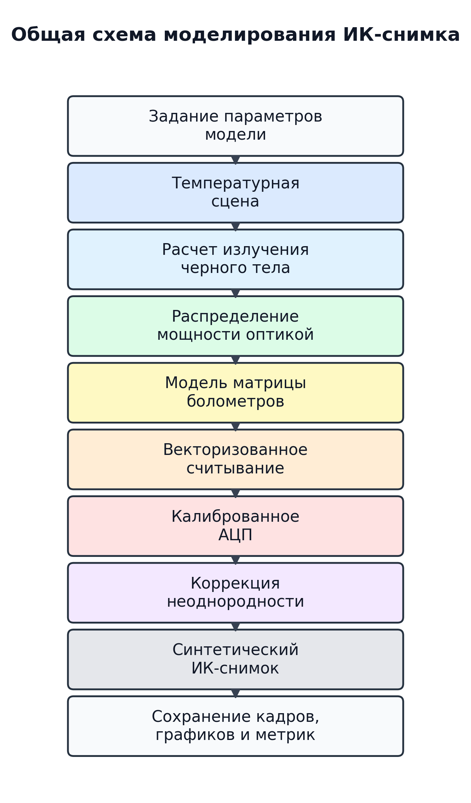
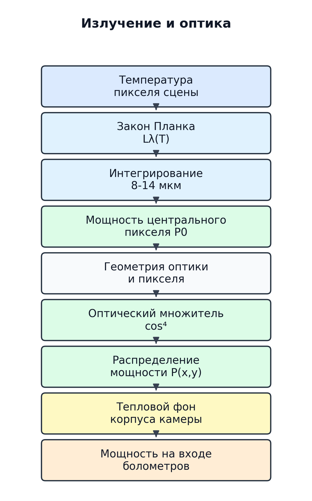
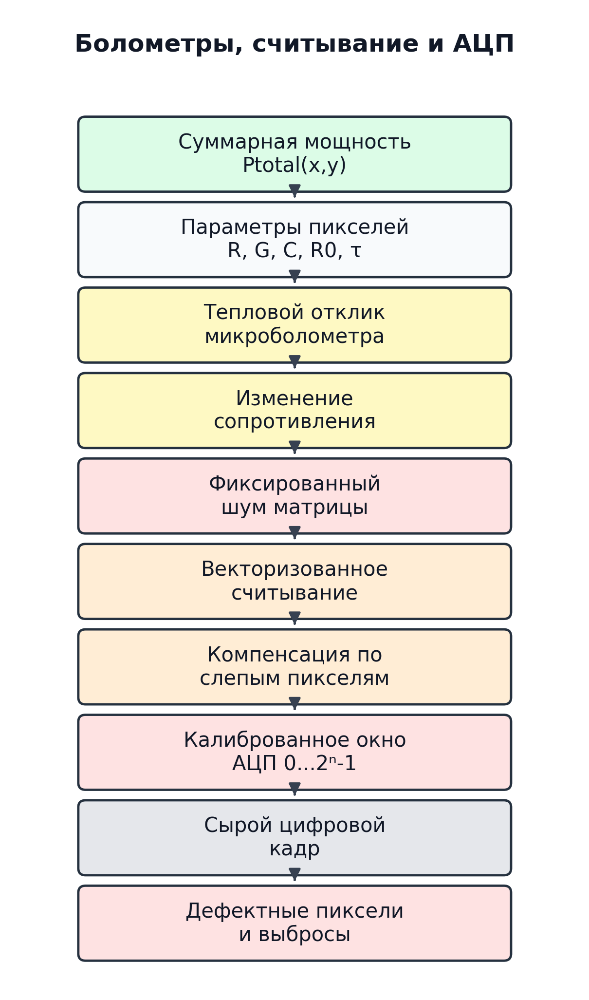
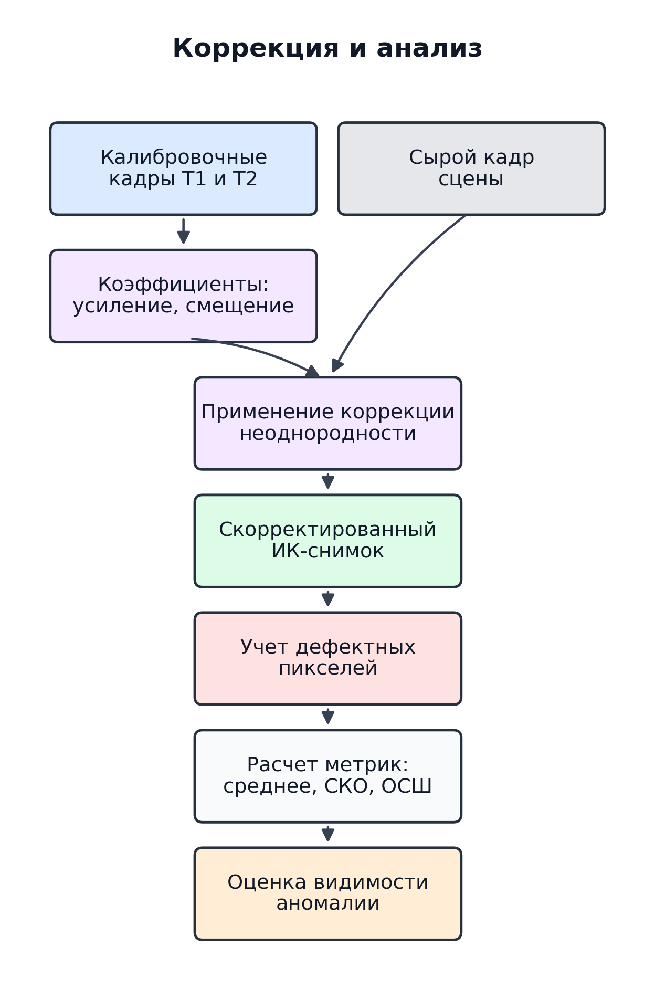

# Блок-схемы алгоритма моделирования ИК-снимков

Файлы в этой папке содержат вертикальные блок-схемы алгоритма получения синтетических инфракрасных изображений.
Подробное текстовое описание для раздела дипломной работы сохранено в `algorithm_synthetic_images.md`.

## Схемы

## Файлы

- `algorithm_synthetic_images.md`
- `01_obshchaya_shema_modelirovaniya.png` / `.svg`
- `02_izluchenie_i_optika.png` / `.svg`
- `03_bolometry_readout_adc.png` / `.svg`
- `04_korrektsiya_i_analiz.png` / `.svg`
